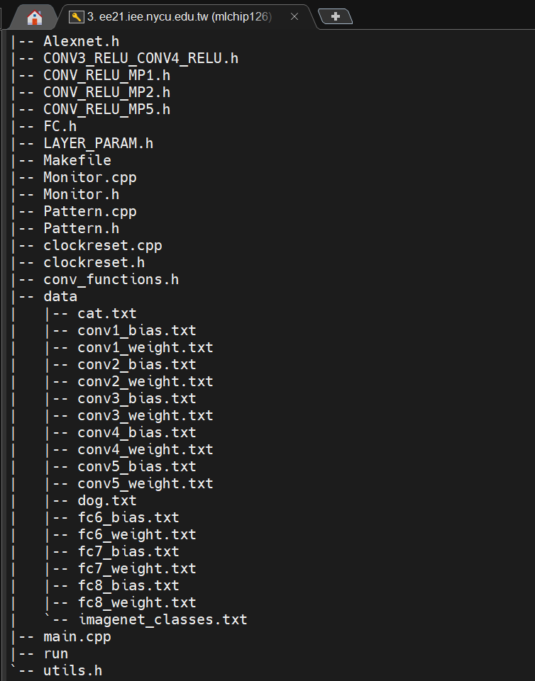
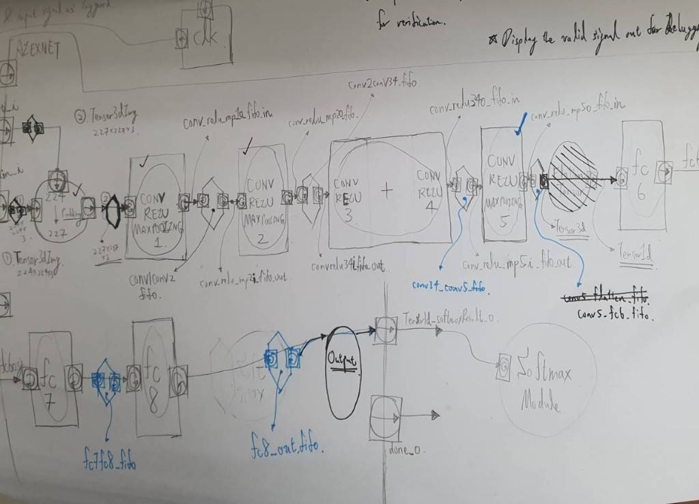
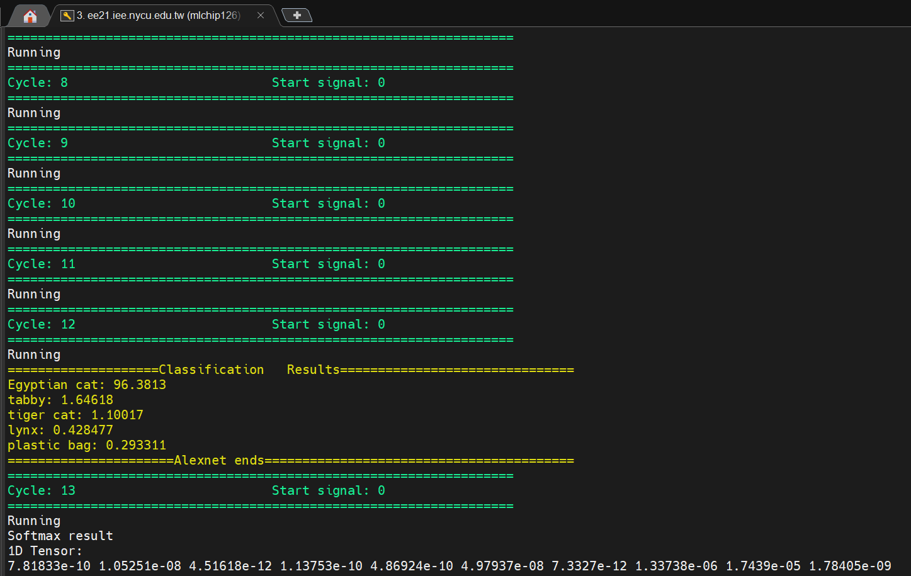
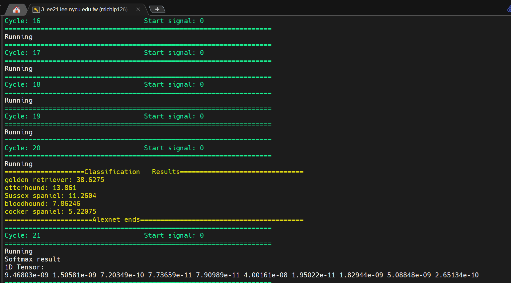

# <strong><font face = "Times New Roman"><p style="text-align: center;">HW2 AlexNet modularization, Interfaces & Channels</p></font></strong>
## <font face = "Times New Roman"><p style="text-align: center;">Machine learning Chip Design</p></font>
### <font face = "Times New Roman"><p style="text-align: center;">312591037, Shun-Liang Yeh, NYCU ICST</p></font>
### <font face = "Times New Roman"><p style="text-align: center;">4/5/2024</p></font>


# File structure
<p align="center">
  
</p>

<div style="page-break-after: always;"></div>

# Architecture
<p align="center">
  
</p>

- First partition the whole AlexNet into multiple blocks, then connect each blocks with sc_fifo channel and sc_fifo interfaces
<div style="page-break-after: always;"></div>

# Results
<p align="center">
  
</p>

<p align="center">
  
</p>

<div style="page-break-after: always;"></div>

# Problem faced
- Understand the Virtual system Modeling of systemC

- Partitioning of Blocks are not ideal at first, thus need some time to do the correct partitioning. Fifo is a good tool to use but seeing the stuff within the fifo does not seems to be permissible, which hinders the validation.

- Understand that fifo is useful for auto managing the data stream within a huge system, also slightly understand the power of SystemC as a HW/SW Co-Design language.

- SystemC sc_port, sc_in, sc_out does not support way too complex data type. I declared a complex data type here which are unable to be identify by the in/out ports.
```C++
typedef std::vector<std::vector<std::vector<std::vector<double>>>> Tensor4d;
```
- Changing it to the following solve the problem.
```C++
    double * tensor;
```

- Segmentation fault occurs if the data you passed to other modules are NULL pointer, beware of that by printing out all stuff in each layer.


# Comment
- Understand how SC_THREAD() and interface works also how it interacts with the Modules. And the parametrization of Modules to enable HW reuse. Lots of examples are studied to implement this lab.

# References
- [Lab1 MAC exercise and handouts]()
- [Jimmy Chenのyoutube, 陳坤志](https://www.youtube.com/watch?v=W-wPa8nNc74)
- [Introduction to ESL NTU,簡韶逸](https://camdemy.com/media/26605)
- [Multi-Media SOC Design NTU, SystemC Tutorial (I),簡韶逸](chrome-extension://efaidnbmnnnibpcajpcglclefindmkaj/http://media.ee.ntu.edu.tw/courses/msoc/slide/02_SystemC_Tutorial.pdf)
- [Multi-Media SOC Design NTU, SystemC Tutorial (I) lecture,簡韶逸](https://camdemy.com/media/24282)
- [Multi-Media SOC Design NTU, SystemC Tutorial (II),簡韶逸](chrome-extension://efaidnbmnnnibpcajpcglclefindmkaj/http://media.ee.ntu.edu.tw/courses/msoc/slide/02_SystemC_Tutorial.pdf)
- [Multi-Media SOC Design NTU, SystemC Tutorial (II) lecture,簡韶逸](https://camdemy.com/media/24319)
